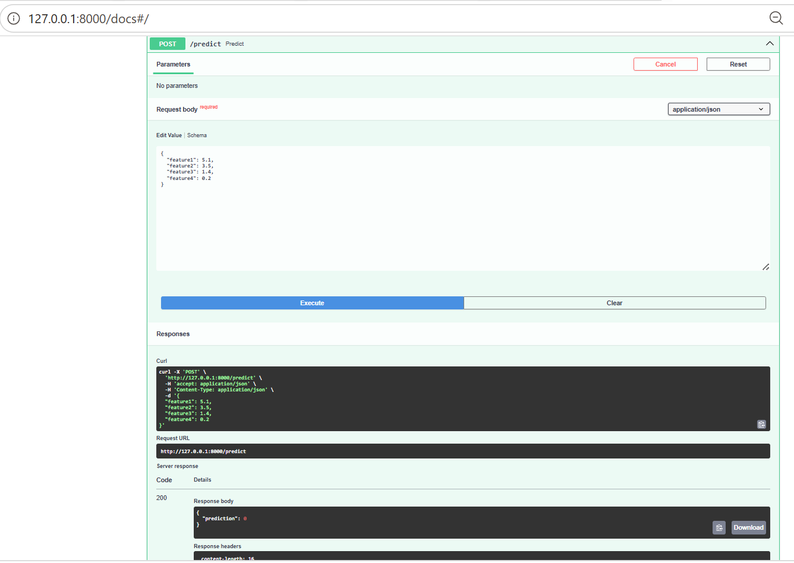

# ML Model Serving API with FastAPI

## Project Overview

This project demonstrates how to serve a machine learning model using FastAPI.

A Random Forest classifier is trained on the Iris dataset using Scikit-Learn and exposed through a REST API. Users can send feature values to the API and receive model predictions in real time.

The project demonstrates core concepts used in MLOps and OpenShift AI environments, including:

- Machine Learning Model Training
- Model Serialization with Joblib
- REST API Development with FastAPI
- Request Validation using Pydantic
- Real-Time Model Inference
- Interactive API Documentation with Swagger UI
- Containerization Readiness with Docker

---

## Technologies Used

- Python
- FastAPI
- Scikit-Learn
- Joblib
- Pydantic
- Uvicorn

---

## Project Structure

```text
model-api/
│
├── train.py
├── app.py
├── requirements.txt
├── model.pkl
└── README.md
```

---

## Model Training

The machine learning model is trained using the Iris dataset.

Algorithm used:

- Random Forest Classifier

The trained model is saved as:

```text
model.pkl
```

Run training:

```bash
python train.py
```

Expected output:

```text
Model saved successfully
```

---

## Running the API

Start the FastAPI server:

```bash
uvicorn app:app --reload
```

The application will be available at:

```text
http://127.0.0.1:8000
```

---

## Root Endpoint

Navigate to:

```text
http://127.0.0.1:8000
```

Response:

```json
{
  "message": "ML Model Serving API"
}
```

---

## Interactive API Documentation

FastAPI automatically generates Swagger UI documentation.

Open:

```text
http://127.0.0.1:8000/docs
```

---

## Testing the Prediction Endpoint

### Step 1

Open Swagger UI:

```text
http://127.0.0.1:8000/docs
```

### Step 2

Expand:

```text
POST /predict
```

### Step 3

Click:

```text
Try it out
```

### Step 4

Enter the following sample request:

```json
{
  "feature1": 5.1,
  "feature2": 3.5,
  "feature3": 1.4,
  "feature4": 0.2
}
```

### Step 5

Click:

```text
Execute
```

### Response

```json
{
  "prediction": 0
}
```

This confirms that the trained machine learning model is successfully loaded and serving predictions through the API.

---

## Screenshots

### Swagger UI Prediction Test




This screenshot demonstrates:

- FastAPI Swagger documentation
- Request payload submission
- Successful API execution
- Returned machine learning prediction

---

## Key Learning Outcomes

This project demonstrates:

- Machine Learning Model Serving
- API Development using FastAPI
- REST Endpoint Design
- Request Validation using Pydantic
- Model Serialization and Loading
- Real-Time Inference
- MLOps Fundamentals

## Kubernetes Deployment Extension
Overview

This project was extended with Kubernetes deployment manifests to demonstrate how a machine learning model serving application can be prepared for deployment in Kubernetes and OpenShift environments.

The FastAPI application serves predictions from a trained Scikit-learn machine learning model through REST API endpoints. Kubernetes configuration files were added to simulate production deployment architecture and service exposure.

## Docker Containerization Preparation

As part of the deployment workflow, Docker Desktop was connected to Ubuntu 24.04 through WSL2 integration.

Activities completed:

Verified Docker Desktop connectivity from Ubuntu
Configured WSL integration between Windows and Ubuntu 24.04
Validated Docker client and Docker Engine communication
Created a Dockerfile for application containerization
Prepared the application for container-based deployment

Although the container image build was affected by network interruptions during package downloads, the project was successfully prepared for Docker-based deployment workflows.

Kubernetes Components
Deployment

The Kubernetes Deployment manifest defines:

Application container configuration
Replica management
Pod lifecycle management
Container port exposure

File:

k8s/deployment.yaml
Service

The Kubernetes Service manifest defines:

Internal service discovery
Traffic routing to application pods
Stable network endpoint for API consumers

File:

k8s/service.yaml
Architecture
User Request
     ↓
Kubernetes Service
     ↓
Deployment Pod
     ↓
FastAPI Application
     ↓
Machine Learning Model
     ↓
Prediction Response
Project Structure
model-api/
│
├── app.py
├── model.pkl
├── train.py
├── requirements.txt
├── Dockerfile
├── README.md
│
├── k8s/
│   ├── deployment.yaml
│   └── service.yaml
│
└── screenshots/
Skills Demonstrated
Python
FastAPI
Scikit-learn
Machine Learning Model Serving
REST API Development
Docker Fundamentals
Kubernetes Fundamentals
Deployment Configuration
OpenShift-Oriented Architecture
MLOps Foundations
